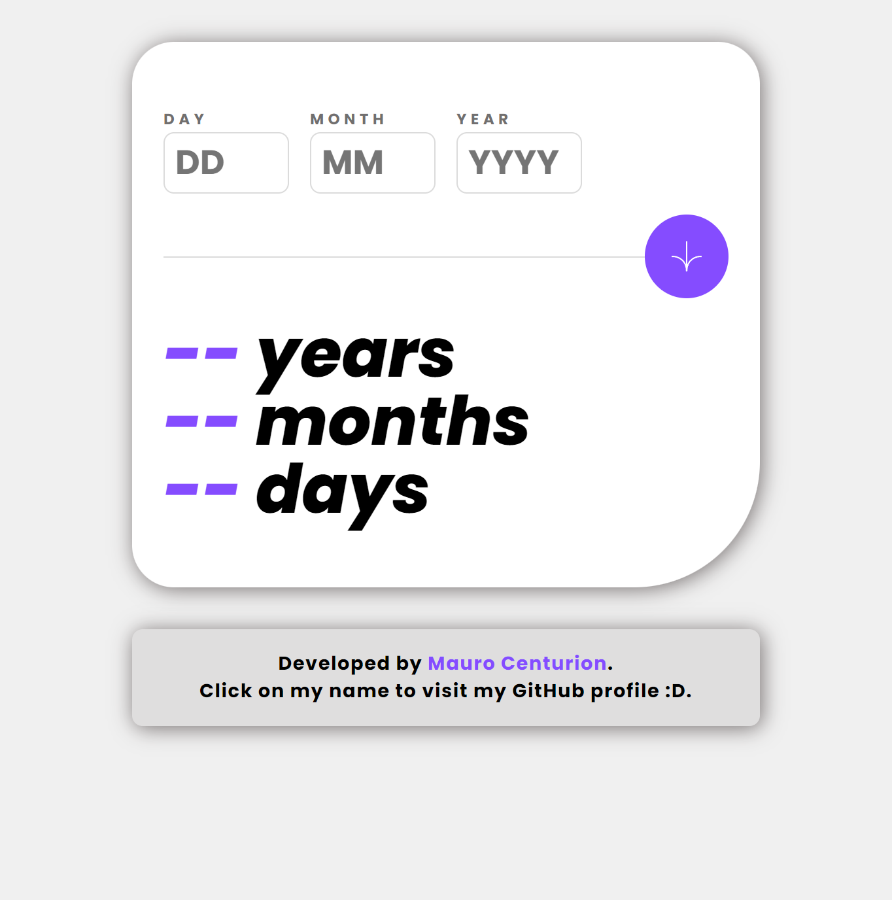

# Frontend Mentor - Age calculator app solution

This is a solution to the [Age calculator app challenge on Frontend Mentor](https://www.frontendmentor.io/challenges/age-calculator-app-dF9DFFpj-Q). Frontend Mentor challenges help you improve your coding skills by building realistic projects. 

## Table of contents

- [Overview](#overview)
  - [The challenge](#the-challenge)
  - [Screenshot](#screenshot)
  - [Links](#links)
- [My process](#my-process)
  - [Built with](#built-with)
  - [What I learned](#what-i-learned)
  - [Continued development](#continued-development)
  - [Useful resources](#useful-resources)
- [Author](#author)
- [Acknowledgments](#acknowledgments)

## Overview

### The challenge

Users should be able to:

- View an age in years, months, and days after submitting a valid date through the form
- Receive validation errors if:
  - Any field is empty when the form is submitted
  - The day number is not between 1-31
  - The month number is not between 1-12
  - The year is in the future
  - The date is invalid e.g. 31/04/1991 (there are 30 days in April)
- View the optimal layout for the interface depending on their device's screen size
- See hover and focus states for all interactive elements on the page

### Screenshot

### Links

- Solution URL: [Add solution URL here](https://your-solution-url.com)
- Live Site URL: [Add live site URL here](https://your-live-site-url.com)

## My process

### Built with

- Semantic HTML5 markup
- CSS custom properties
- Flexbox
- Mobile-first workflow

### What I learned

When I started the project I thought it would take less time, but when it came to coding the JavaScript code I encountered several problems.
Obviously, problems in terms of logic and I faced them with a lot of enthusiasm, since it is another challenge that I overcame.
I learned about date handling and what are the advantages of using the **Date** object over numbers to indicate the year, month and day of birth.

### Continued development

What I am not very convinced about is the implementation of the validation of each one of the inputs. It was more difficult than I thought.
Starting with validating that the date is in the past, that the days correspond to the number of days in the month, etc.
I hope to improve these functions for validation, I will be working on it because I am sure there is a better implementation.

### Useful resources

- [Date - Javascript | MDN](https://developer.mozilla.org/en-US/docs/Web/JavaScript/Reference/Global_Objects/Date) - This hThe Mozilla documentation is the most complete, so I recommend the Date object page. 
It helped me a lot.

## Author

- Website - [Mauro Centurion](https://github.com/maurocentu26)
- Frontend Mentor - [@maurocentu26](https://www.frontendmentor.io/profile/maurocentu26)

## Acknowledgments

To me :D (Again).